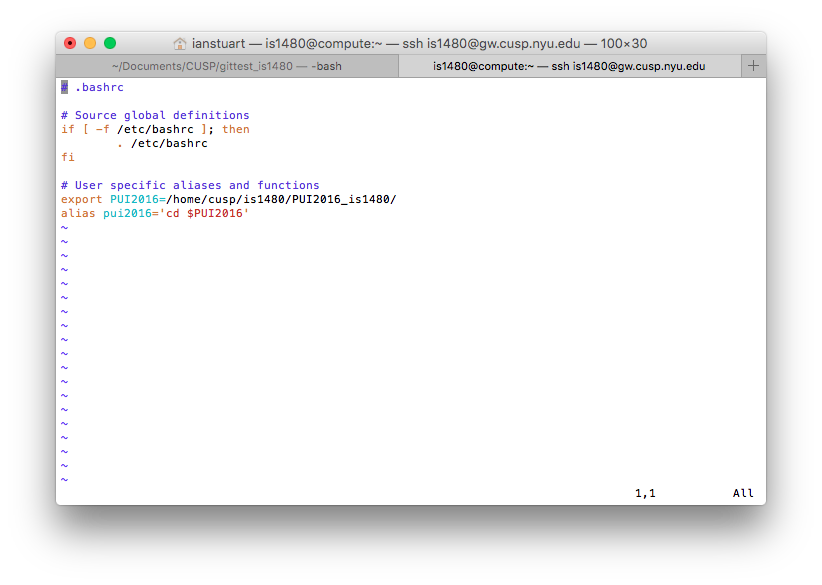
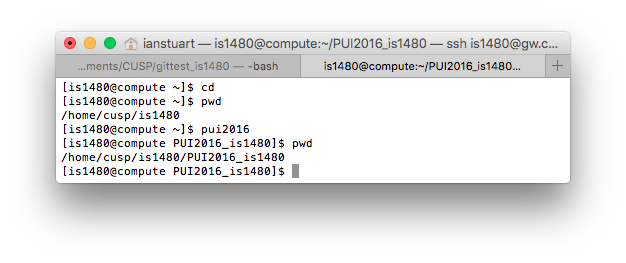

# HW1 - Ian Stuart

## Setting up environment variables

To set up environment variables to allow easier access to the PUI directory on compute, I edited the .bashrc file located in the /home/cusp/is1480 directory. These lines were added to the file:
```
export PUI2016=/home/cusp/is1480/PUI2016_is1480/
alias pui2016='cd $PUI2016'
```
Images of the .bashrc file and the new variables in use are below:


