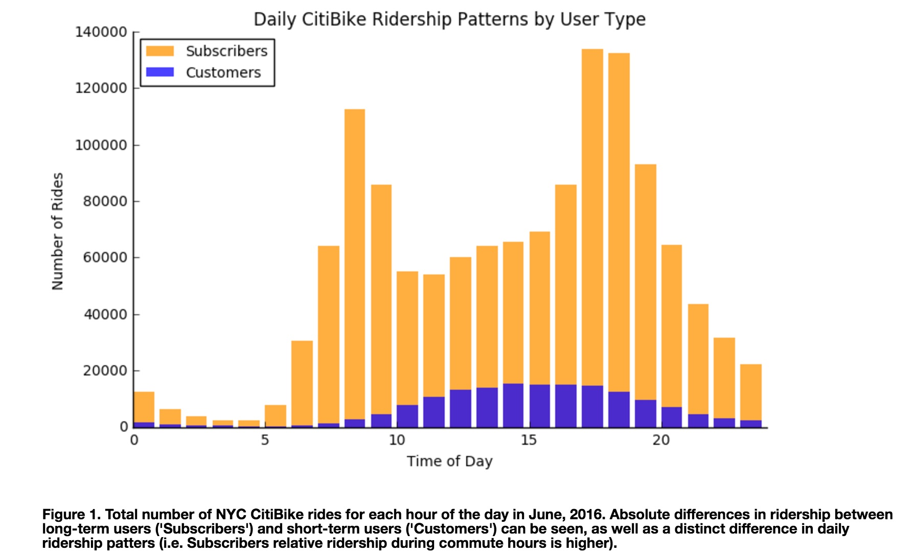

Ian, this is a gorgeous graph - nice work! I think the stacked bar is very effective in this scenario, clearly showing the commuting vs. tourism-esque ridership patterns along a common time series. The color scheme is aesthetically pleasing, and makes distinguishing between the two customer types very easy. You've managed to eliminate all unneccesary "ink" from the plot, allowing the viewer to understand the narrative with only a quick glance. The plot is simple and honest in what it's showing a viewer.

Only two small criticisms:
1) This is subjective, but I'd like to see 12hr times (am/pm) on the x-axis instead of 24hrs. I think it makes the graph a bit more approachable, and easy to align ridership patterns with a particular time in the day.
2) Although you call out the difference in the plot's caption, I think you could've used clearer aliases in the legend, instead of "subscribers" and "customers". For someone who isn't familiar with Citibike, the difference between these two may not be obvious.
