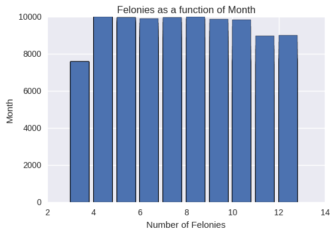

## Plot Review

This plot intends to show how many felonies occur during each month of the year. While I might be able to learn more about what data the
plot is actually representing by reviewing the code, the plot itself does not give me any more information. The title and axis labels, while exhibiting errors, are clearly readable.

My suggestions:
* Assume that readers may only be looking at the plot, and not accompanying data or text. Make the plot readable as a stand-alone graphic by including information like the time period and location for which the data used was collected. If this doesn't fit in the title and axis labels, it can easily be included in a caption.
* The axis labels are switched - this is an easy fix.
* The bottom axis should probably just include all the month names or the numbers 1-12.
* Since many months have right around the same number of felonies, there may be a different aspect of the data that is more suited to being represented as a per month quantity.
